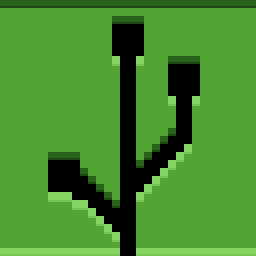

# MCGit

**Requires MC 1.21.11 Fabric**

MCGit is a Minecraft mod that brings Git-like version control to your Minecraft world. It allows you to track changes to
blocks and entities, commit those changes, and manage different versions of your world.
- If you blow up your base or do a change that doesn't look good, you can just `/git revert`.
- If you make a change that does look good, do a commit: `/git commit <msg>`
- You can back up your build and share it using a free hosting service like [GitHub](github.com).
- You can never lose your progress, every committed version of the build is saved.
- You can "fork" other people's builds and modify them to your liking as long as they allow it.
- Other people's builds can be cloned directly into your world.
- Very lightweight and easy to use.
- **Does not require external tools:** you do not need to install Git or any other software outside of Minecraft. MCGit 
bundles JGit, a pure Java implementation of Git, to handle all Git operations internally.

Dependencies: JGit

## Commands

Commands marked with `@` require `setblock` access.\
`[..]` indicates optional arguments.

**NOTE**: It is **perfectly normal** for errors like "Couldn't set block" to appear. These just mean that MCGit tried changing a block to itself. This is harmless.

**NOTE2**: If you do not have `/git autoadd` and `/git autorm` enabled, you need to manually add and remove block/s to/from the staging area using `/git add` and `/git rm`.\
To prevent confusion, this is now enabled by default **but only in creative mode**.

-  `/git init <name>` Initialize a new MCGit repository.
-  `/git activate <name>` Switch to the specified repository.
-  `/git add <coords>` Add one block at the specified coordinates to the staging area.
-  `/git add <coords> <coords> [|hollow|outline]` Add a cuboid of blocks to the staging area
- @`/git rm <coords> [coords] [|hollow|outline]` Remove blocks/entities from the staging area and revert them. NOTE: Changing blocks/entities in the world needs to be done by issuing commands, as this is a clientside mod.
-  `/git unstage ...`  does not revert , only removes from staging area.
-  `/git commit [-m] "message"` Commit the staged changes with a message. The `-m` flag does nothing.
- @`/git revert [commit-hash]` `/git reset` but it changes the world as well. Commit hash can be omitted to revert to the latest commit (HEAD).
-  `/git reset [commit-hash]` Reset to a specific commit hash or the latest commit. This does not revert the actual world. This is the reverse of `/git add`
-  `/git status` Show the current status of the repository, including staged changes, unstaged changes, but not untracked blocks/entities.
-  `/git commitList` Lists all commits in the current branch.
-  `/git repoList` Lists all available repositories.
-  `/git autoadd [toggle|on|off]` Enable or disable automatic addition of changes to the staging area. To quickly switch between, use an enchanted red wool in offhand to make this act toggled (so if you have it in offhand, auto add is off, otherwise on).
-  `/git autorm [toggle|on|off]` Enable or disable automatic removal of deleted blocks/entities from the staging area. To quickly switch between, use an enchanted red wool in offhand to make this act toggled (so if you have it in offhand, autorm is off, otherwise on).
- @`/git clone <name> <url/local>` Clone a remote repository from the specified URL into a new local repository with the given name.
  URL can be a local repository name (like `myrepo`), or a GitHub `author/repo` (like `octocat/Hello-World`) or a full URL to a git repository (like `https://github.com/octocat/Hello-World.git`).
-  `/git clonesoft <name> <url> ` `/git clone` but do not put it in the world
- @`/git put <local>` `/git clone` but do not save as a new repo.
-  `/git remote add [remote=origin] <url>` Add a new remote repository with the specified name and URL.
- @`/git pull  [remote=origin] [branch=main] [default|ff-only|rebase|no-rebase]` Fetch and merge changes from the specified remote repository and branch into the current branch. `default` is the same as `ff-only` but included for autocomplete user-friendliness.
-  `/git fetch [remote=origin] [branch=main] [default|ff-only|rebase|no-rebase]` `/git pull`
-  `/git push  [force|noforce] [remote=origin] [branch=main] ` Push committed changes to the specified remote repository and branch.
-  `/git auth <username> [password]` Store authentication credentials for accessing remote repositories. If password is omitted, only username is stored.
**NOTE** Credentials are stored unencrypted as plaintext.
- `/git branch <name>` Switch to a branch with the given name, or create it if it does not exist.
